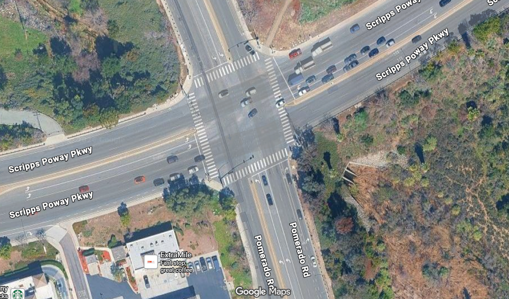
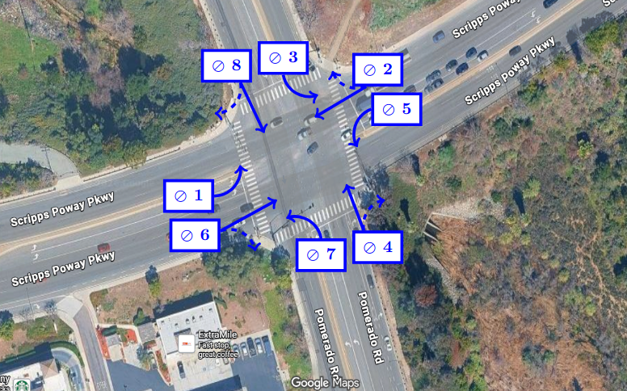
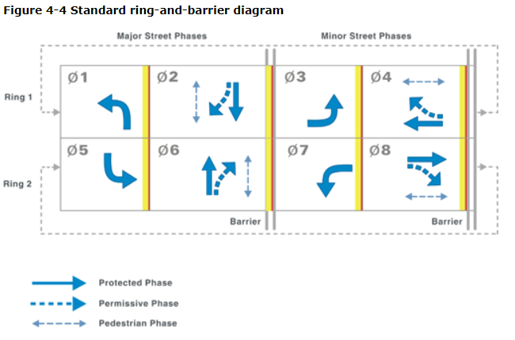
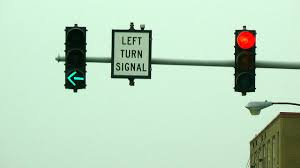
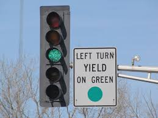
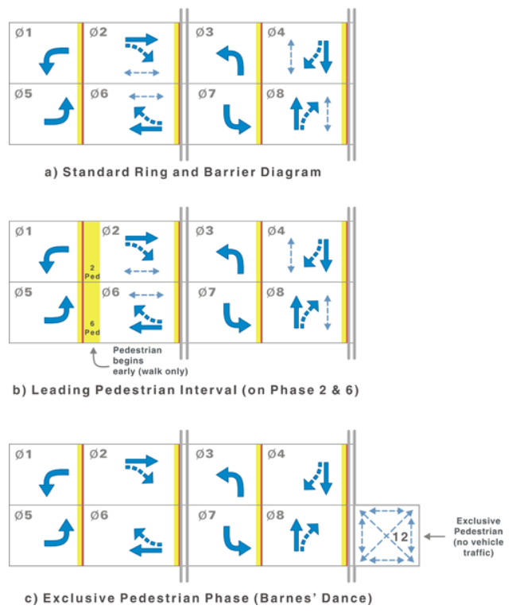
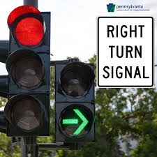

# Traffic Light Project Notes

This is a personal project to help me learn PLC programming using TwinCAT3 and the structured text language.

The goal of this project is to familiarize myself with the TwinCat PLC Programming Software in the design and implementation of a traffic light system. The PLC will utilize the Structured Text programming language to implement the control scheme. This traffic light system is designed with the intersection of the 6 lane Scripps Poway Parkway and 4 lane Pomerado Road in mind. This crossing features protected left turn lanes, protected right turns when cross traffic is turning, and 4 way pedestrian crossings.

Note to view a preview of this markdown document, please use the keyboard shortcut Ctrl + Shift + V.

## Intersection Satellite View

# Traffic Phases and the Ring and Barrier Structure

Traffic safety engineers utilize what are called signal or traffic phases to represent the allowable movements for vehicles through an intersection. According to [1, section 4.2.1], a signal phase is defined as *"the right of way, yellow change, and red clearance intervals in a cycle that are assigned to an independent traffic movement or combination of traffic movements."* For a standard four way intersection like the Scripps Poway Parkway and Pomerado Road crossing, there are eight possible phases that move traffic either through the intersection or turning onto anothr street. Each traffic phase is defined with time intervals (the duration of time where the signal indications do not change) which describe the length of the green, yellow, and red clearance signals shown by the traffic light. In addition, all traffic phases have an ID number where odd number phases correspond to left turn movements and even numbers represent through movements and permissible right turns. There are two different conventions for assigning these traffic phase ID's for a given intersection. One practice is to set traffic phase 4 to be the most northernly pointed phase, and then the rest of the phases are numbered relative to this choice. The other option which we will use for this work is to assign phases 2 and 6 to the major street movements, and the rest of the phases will be numbered accordingly. Using this practice, I number the traffic phases for the Scripps Poway Parkway and Pomerado Road crossing as such.

Traffic phases can be organized into groups called rings which run the phases in a continuous loop. The ring helps schedule conflicting traffic phases so that they do not overlap with one another. For example, traffic phase 1 and traffic phase 2 cannot be run simultaneously since this would cause an accident. Instead the ring schedules traffic phase 1 and only after the cycle is complete does phase 2 begin. Traffic phases 1, 2, 3, and 4 can be put into ring 1 while phases 5, 6, 7, and 8 are put into ring 2. From the diagram, we see a typical ring and barrier diagram where complementary phases like 1 and 5 are run concurrently. 

# Desired Behaviour

Here we outline desired behaviour for our traffic light PLC system.

### Protected Only Left Turn Phasing

According to [1, section 4.3.2], protected only left turn phasing *"assigns the right of way to drivers turning left at the intersection and allows turns to be made only on a green arrow display."* An example of which is shown by the signal below. This protected left turn operation is typically provided in traffic phases 1, 3, 5, and 7.

This protected turn phase is desirable over the alternative unprotected, permissive, or "left turn yield" phase due to its safety benefits. The permissive left turn phase is typically more dangerous since it relies on motorists to choose acceptable times to make their turns.

### Leading Pedestrian Interval

According to [1, section 4.5] related to pedestrian phasing, *"a leading pedestrian interval starts a few seconds before the adjacent through movement phase. This allows pedestrians to establish a presence in the crosswalk and thereby reduce conflicts with turning vehicles. This option supports improved safety for pedestrians by allowing them increased visibility within the intersection and is applicable to intersections where there are significant pedestrian-vehicle conflicts"*. In the image below, figure (b) represents the leading pedestrian interval as opposed to the standard ring and barrier shown in (a). Figure (c) is used typically for intersections with a high volume of pedestrian traffic, allowing people to cross with no vehicular movements.

### Protected Right Turn Overlap with Complementary Left Turn Movement

According to [1, section 4.6] related to right turn phasing, a protected right turn movement may be correlated to the phase corresponding to the complementary left turn movement of the cross street. An example of which is shown by the signal below.

The following conditions should be satisfied in order to implement this functionality:
1) The protected right turn movement is used in conjunction with dedicated right turn lanes
2) The right turn volume is high to make this implementation desirable
3) The left turn phase for the complementary left turn movement on the cross road is protected (meaning no through traffic)
4) U turns are forbidden in the complementary left turn lane

# Level One: PLC Runs a Standard Ring and Barrier Sequence

The goal of level one is to program the PLC to automatically run a standard ring and barrier sequence. In this level, we do not consider any inputs to the control system, rather we are just creating a pre-programmed sequence of outputs to run indefinitely. In this level, we will set the foundation for the rest of the project by creating the traffic phase function block, a basic human-machine interface (HMI visualization), and some simple logging functionality.

## Control System Outputs

The outputs to our system are simply Red, Yellow, and Green LED signal lights. The state (on/off) of these lights will be represented by booleans associated with a particular traffic phase. To power signal lights such as the ones found in the following links, one must supply 120V AC.

[TrafficLights.com Lights](https://www.trafficlights.com/products/wireless-remote-controlled-safety-light-hp200-rcn3)

[Grainger Traffic Light](https://www.grainger.com/product/29XG24?gucid=N:N:PS:Paid:GGL:CSM-2296:EK0NT3:20940226:APZ_1&gclsrc=aw.ds&gad_source=1&gad_campaignid=23543672121&gclid=Cj0KCQjwj47OBhCmARIsAF5wUEGls_YnsPxO0sl_TDRZOIklyqB3RnNkqW_FbX-7iGu-UA2_imwdDesaAqBhEALw_wcB)

## The Traffic Phase Function Block

## HMI Visualization

## Simple Logging Functionality

# References

[DOT FHWA Traffic Signal Design](https://ops.fhwa.dot.gov/publications/fhwahop08024/chapter4.htm)

[Practical Engineering](https://practical.engineering/blog/2019/5/11/how-do-traffic-signals-work)

[Traffic Light Doctor](https://www.youtube.com/watch?v=R_2qUW4h6NM)

# Citations
[1] “Traffic Signal Timing Manual: Chapter 4 - Office of Operations.” Dot.gov, 2026, ops.fhwa.dot.gov/publications/fhwahop08024/chapter4.htm#4.5. Accessed 11 Mar. 2026.
